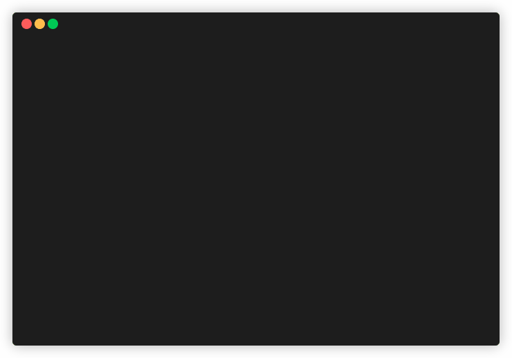

# QuickAccess

QuickAccess (QA) is a tiny app written in Go.
It serves one purpose: to create a quick access menu in your terminal.
Menu items are basically shortcuts to shell command.

Type `qa` in your terminal to bring up the menu:



You can use this app to:

* quickly connect to remote servers by SSH
* simplify various daily tasks

## Build

To build this app for your current platform, type:

```shell
go get && go build
```

To build it for every supported platform (linux/x64 and windows/x64), type:

```shell
make
```

## Installing

### Installing from source

```shell
go get -u github.com/kapitanov/qa
```

### Downloading pre-built binaries

* For Linux/x64:

  ```shell
  curl -L https://github.com/kapitanov/qa/releases/download/v0.2.0/qa-0.2.0-linux-x64.zip -o qa.zip
  unzip qa.zip -d /usr/local/bin/
  chmod +x /usr/local/bin/qa
  rm qa.zip
  ```

* For Windows/x64:

  ```powershell
  $QA_URL = "https://github.com/kapitanov/qa/releases/download/v0.2.0/qa-0.2.0-windows-x64.zip"
  (New-Object System.Net.WebClient).DownloadFile($QA_URL, "qa.zip")
  $QA_DIR = join-path $env:LOCALAPPDATA "QA-App"
  Expand-Archive qa.zip -d $QA_DIR
  $envPath = Get-ItemProperty -Path 'Registry::HKEY_LOCAL_MACHINE\System\CurrentControlSet\Control\Session Manager\Environment' -Name PATH
  $envPath = "$envPath;$QA_DIR"
  Set-ItemProperty -Path 'Registry::HKEY_LOCAL_MACHINE\System\CurrentControlSet\Control\Session Manager\Environment' -Name PATH -Value $envPath
  $env:PATH = "$env:PATH;$QA_DIR"
  Rm qa.zip
  ```

  > **Note:** you might need to restart your computer for `PATH` changes to take effect.
  > If you have [chocolatey](https://chocolatey.org/) installed, you can run `refreshenv` script.
  > It'll apply `PATH` changes without restarting.

After that, you should be able to execute a `qa` command in your terminal.

## Configuring

You need to create a JSON file `.qa` in your home directory with the following content:

```json
{
    "commands" :[
        {
            "name":"Command display name",
            "cmd" :"command_to_execute"
        },
        {
            "name":"Command display name",
            "cmd" :"command_to_execute",
            "args" : ["list","of","arguments"]
        }
    ]
}
```

Root element `commands` is required and it has to be an array.
Its items map are menu items. Their properties are:

* `name` - a menu item title (required element)
* `cmd` - a command to run (required element)
* `args` - a list of command's arguments (optional)

You can use environment variables in `cmd` and `args`, including:

* `~` and `$HOME` for current user's home directory
* `$(pwd)` for current directory
* `$ENV_VAR_NAME` for enviroment variable `ENV_VAR_NAME`
